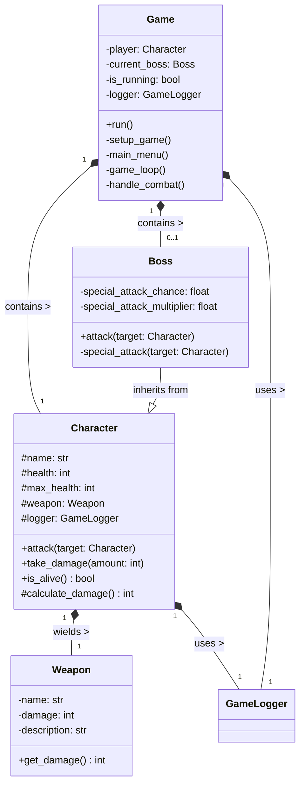

# RPG Lesson: Object-Oriented Programming

[](https://www.python.org/downloads/)
[](https://opensource.org/licenses/MIT)
[](https://github.com/psf/black)

## Educational Purpose

This project is designed as an educational tool to demonstrate Object-Oriented Programming (OOP) concepts in Python. The code is intentionally structured to be clear, readable, and easy to understand for students learning OOP principles.

## Features

- **Core OOP Principles**: Demonstrates classes, objects, inheritance, polymorphism, encapsulation, and abstraction
- **Modular Design**: Clean separation of concerns with dedicated modules for different game components
- **Type Hints**: Comprehensive type annotations for better code clarity and IDE support
- **Testing**: Comprehensive test suite with pytest
- **Documentation**: Detailed docstrings and project documentation

## Installation

1. Clone the repository:
   ```bash
   git clone https://github.com/antoekneeo/11SE_OOP_RPG_BLEH.git
   cd 11SE_OOP_RPG_BLEH
   ```

2. (Optional) Create and activate a virtual environment:
   ```bash
   python -m venv venv
   source venv/bin/activate  # On Windows: venv\Scripts\activate
   ```

3. Install the package in development mode:
   ```bash
   pip install -e ".[dev]"
   ```

## Running the Game

### As a Package
```bash
python -m rpg_game
```

### Using the Entry Point
```bash
rpg-game
```

### Directly from Source
```bash
python src/rpg_game/__main__.py
```

## Project Structure and Design

### UML Class Diagram



### Project Structure

```
11SE_OOP_RPG_BLEH/
├── src/
│   └── rpg_game/          # Main package
│       ├── __init__.py     # Package initialization and public API
│       ├── __main__.py     # Entry point
│       ├── boss.py         # Boss class (inherits from Character)
│       ├── character.py    # Base Character class
│       ├── console_utils.py # Console utilities
│       ├── constants.py    # Game configuration and constants
│       ├── game.py         # Main game logic
│       ├── game_logger.py  # Game logging
│       ├── save_game.py    # Save/load functionality
│       └── weapon.py       # Weapon class
├── tests/                  # Test suite
│   ├── __init__.py
│   ├── conftest.py         # Test fixtures
│   ├── test_boss.py
│   ├── test_character.py
│   ├── test_game.py
│   └── test_weapon.py
├── .gitignore             # Git ignore rules
├── .pre-commit-config.yaml # Pre-commit hooks
├── CHANGELOG.md           # Version history
├── CODE_OF_CONDUCT.md     # Community guidelines
├── CONTRIBUTING.md        # Contribution guidelines
├── LICENSE                # MIT License
├── MANIFEST.in            # Package data files
├── pyproject.toml         # Build configuration
├── README.md              # This file
├── requirements-dev.txt    # Development dependencies
└── setup.cfg              # Additional package configuration
```

### Key Design Patterns

1. **Inheritance**:
   - `Boss` inherits from `Character`
   - Demonstrates method overriding with `attack()`

2. **Composition**:
   - `Character` contains a `Weapon`
   - `Game` contains `Character` and `Boss`

3. **Encapsulation**:
   - Private attributes with getters/setters
   - Protected attributes for inheritance

4. **Dependency Injection**:
   - `GameLogger` is injected into classes that need logging

## Development

### Setting Up Development Environment

1. Install development dependencies:
   ```bash
   pip install -e ".[dev]"
   ```

2. Configure pre-commit hooks (optional but recommended):
   ```bash
   pre-commit install
   ```

### Running Tests

Run all tests:
```bash
pytest
```

Run tests with coverage report:
```bash
pytest --cov=rpg_game
```

### Code Style

This project uses:
- **Black** for code formatting
- **isort** for import sorting
- **mypy** for static type checking
- **pylint** for code quality

Run all code quality checks:
```bash
black .
isort .
mypy src/
pylint src/
```

## Educational Focus

This project is designed to demonstrate key OOP concepts:

### COIPEA: Core OOP Principles

- **C**lasses and **O**bjects
- **I**nheritance
- **P**olymorphism
- **E**ncapsulation
- **A**bstraction

### Key Design Patterns
- Factory Pattern (Weapon creation)
- State Pattern (Game states)
- Observer Pattern (Game events)

## Contributing

Contributions are welcome! Please read our [contributing guidelines](CONTRIBUTING.md) before submitting pull requests.

## License

This project is licensed under the MIT License - see the [LICENSE](LICENSE) file for details.

### 1. Classes and Objects
- The code defines several classes (`GameLogger`, `Weapon`, `Character`, `Boss`, `Game`) that encapsulate data and behavior
- Objects are instantiated from these classes (e.g., player character, bosses, weapons)

### 2. Inheritance
- `Boss` inherits from `Character`, demonstrating class hierarchy
- The `super().__init__()` call in `Boss.__init__` shows proper parent constructor invocation
- Method overriding is shown in `Boss.attack()` which extends the parent's method

### 3. Polymorphism
- Method overriding in `Boss.attack()` demonstrates polymorphism - same method name but different behavior than parent class
- The `attack()` method behaves differently depending on the actual object type (Character vs Boss)
- This allows for treating different object types through a common interface

### 4. Encapsulation
- Each class encapsulates its own data (attributes) and behavior (methods)
- Classes have clear responsibilities and manage their own state
- Objects maintain their internal state and expose functionality through methods
- The `Character` class demonstrates proper encapsulation with:
  - A private `_health` attribute (indicated by the underscore prefix)
  - Public `get_health()` and `set_health()` methods for controlled access
  - Data validation in the setter to ensure health is never negative
  - Consistent use of getters/setters throughout the codebase (e.g., in combat logic)
  - The `Weapon` class is composed within the `Character` class, demonstrating strong composition

### 5. Abstraction
- Classes represent abstract concepts (Character, Weapon, Game) hiding implementation details
- The Game class abstracts away the complexity of game flow management
- Users of the classes only need to understand the interface, not internal workings

### 6. Additional Relationships
- **Composition**: Strong composition between `Character` and `Weapon` (a character "has-a" weapon)
- **Dependency**: `GameLogger` demonstrates a dependency relationship (explicitly mentioned as "dotted line in UML")

## UML Class Diagram Concepts

The code demonstrates several UML class diagram concepts including classes, relationships (inheritance, composition, dependency), and various class members.

For a detailed analysis of UML concepts in this code, see [UML_class_diagram.md](UML_class_diagram.md).

## Design Patterns and Principles

### 1. Single Responsibility Principle
- Each class has a clear, focused purpose
- Utility functions are separated into logical groups (e.g., `clear_screen`, `press_enter` in console utilities)
- The `GameLogger` class handles all logging functionality
- The `Weapon` class focuses solely on weapon properties and behavior

### 2. Game Loop Pattern
- The `Game.run()` method implements a simple game loop

### 3. Factory Method (simplified)
- `choose_weapon()` acts as a factory for creating weapon configurations

## OOP Learning Value

### 1. Clear Demonstration of OOP Concepts
- **Inheritance**: The `Boss` class extends `Character` and overrides the `attack` method
- **Encapsulation**: Private attributes with getters/setters in `Character` class
- **Composition**: `Character` contains a `Weapon` object
- **Dependency**: `Game` depends on `GameLogger` for logging
- **Polymorphism**: Different attack behaviours between `Character` and `Boss`

### 2. Progressive Learning Path
1. Start with basic utility functions
2. Introduce simple classes (`Weapon`)
3. Build more complex classes with relationships (`Character`, `Boss`)
4. Show how classes interact in the `Game` class

### 3. Code Organization
- Clear separation of concerns
- Logical grouping of related functionality
- Consistent naming conventions
- Proper use of Python's module system


### Areas That Could Be Challenging 

1. **Multiple Classes at Once**
   - The code introduces several classes simultaneously, which might be overwhelming
   - A more step-by-step approach might build one class at a time

2. **Some Advanced Concepts**
   - Static methods (`@staticmethod`) might need additional explanation
   - The distinction between composition and dependency might be subtle for beginners

3. **Limited Visibility Examples**
   - Doesn't demonstrate private/protected attributes with Python's underscore convention
   - Missing encapsulation examples with getters/setters

## Development

### Setting Up for Development

1. **Clone the repository**
   ```bash
   git clone <repository-url>
   cd 11SE_OOP_RPG_BLEH
   ```

2. **Set up a virtual environment**
   ```bash
   python -m venv venv
   source venv/bin/activate  # On Windows: venv\Scripts\activate
   ```

3. **Install development dependencies**
   ```bash
   pip install -r requirements-dev.txt
   ```

### Running Tests

To run all tests:
```bash
pytest
```

To run tests with coverage report:
```bash
pytest --cov=.
```

To run a specific test file:
```bash
pytest tests/test_character.py
```

To run a specific test case:
```bash
pytest tests/test_character.py::TestCharacter::test_character_creation
```

## Learning Recommendations

### Suggested Learning Approach
1. **Start with the Big Picture**
   - Play the game in action
   - Discuss with a peer the overall architecture and class relationships

2. **Progressive Implementation**
   - Begin with the `Weapon` class (simplest)
   - Move to `Character` class and introduce encapsulation
   - Show inheritance with the `Boss` class
   - Finally, demonstrate the `Game` class that ties everything together

3. **Hands-On**
   - Extend the `Character` class with new abilities
   - Implement a new weapon type with special effects
   - Add a new game mechanic using the existing class structure

4. **Code Review**
   - Walk through the code together with a peer, discussing design decisions
   - Highlight good practices and potential improvements
   - Connect the implementation to the corresponding UML diagram

## Future Enhancements

See [ROADMAP.md](ROADMAP.md) for planned improvements.
